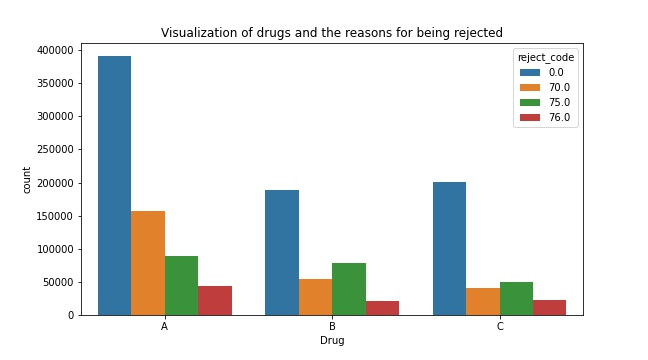
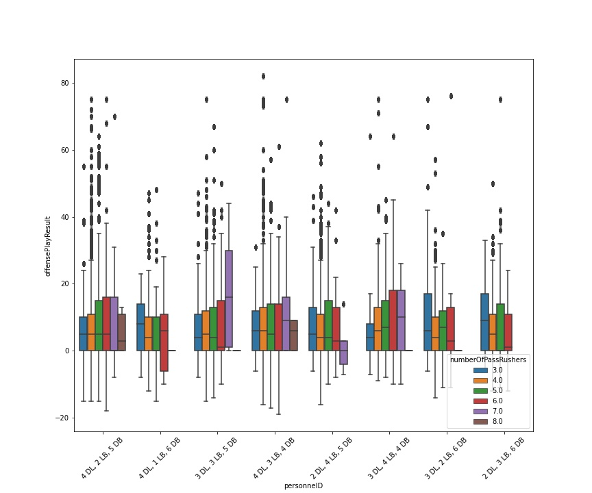
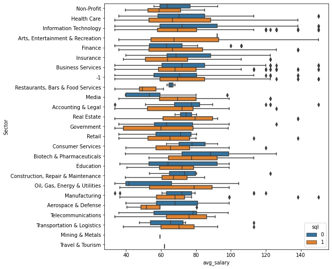

## Howdy!
My name is Andrew Castillo and I am a pure mathematics PhD transitioning into the world of data. Here are a few of the data science projects that I have worked on. Github links to the projects are provided if you would like a more in depth analysis. 
 

 

## [Project 1: CoverMyMeds Erdos Bootcamp Prior Authorization Predictor](https://github.com/azcastillo/covermymeds_project)
Two part project in which I used simulated data based on prior authorization information to make predictions. 

### Project Overview:

Part 1 of the project consisted of creating a model predicting whether a prior authorization would be needed based upon pharmacy claims data. This portion of the project also consisted of exploratory data analysis in which the following questions were answered: 

  * Which insurance companies had the most approved pharmacy claims? 
  * Which drug was approved the most (numerically)? Which rejection code seemed to appear the most with each drug? 
  * What about a scaled version of this? Relatively, how much did each code appear for each drug?

Part 2 of the project consisted of creating a model predicting whether a prior authorization is likely to be approved. This model was based on data contained on the PA such as correct diagnosis, has already tried and failed a generic drug alternative, has health-related reasons not to take certain medications (contraindications), and claims data. Moreover, this portion consisted of exploratory data analysis in which the following questions were answered (based only on the prior authorization data): 

  * What is the relationship between the correct diagnosis, tried and failed, and contraindication and the prior authorization being approved? 
  * Of the people who have or have not tried and failed a generic alternative, how many of them had contraindications or a correct diagnosis? 
 

## [Project 2: NFL Big Data Bowl Erdos Bootcamp Project](https://github.com/azcastillo/erdos2021_nfl_predmodel)

This project was completed as part of the The Erdős Institute Data Science Boot Camp 2021. The NFL Big Data Bowl is an annual analytics contest that explores statistical innovations in football. NFL data from the 2018 season was analyzed to provide recommendations and summaries for optimal defensive coverages, first down analysis, and penalty analysis. To successfully create a prediction model that NFL teams can benefit from, it is important to understand football and its related data. This will allow data scientists to identify significant data for building a model.    

### Project Overview:

**1. Optimal Defensive Coverages:**

Passing plays are the most efficient way for the offensive team to gain field position. Over the course of its history, the NFL has increasingly become a passing focused league.

**GOAL:** Significant data from the 2018 NFL season will be analyzed to find out which defensive coverages result in the smallest EPA and smallest average passing yards to provide recommendations and summaries for optimal defensive coverages.

**2. First Down Analysis:**

An offense has four downs or fewer to advance the 10 yards required to gain a first down, which allows them to maintain possession and earns them another four downs. The goal of the offensive team is to secure first downs and eventually score, while the goal of the defensive team is to prevent first downs and to secure turnovers. Because of this, it is important to find out which offensive formations are best at securing first downs and which defensive formations are best at preventing first downs.

**GOAL:** Analysis will consist of examining factors such as quarter, down, yards to go, play result, play type (pass or sack), and offensive and defensive personnel from the 2018 NFL season to find out the first down success percentage of different offensive and defensive formations. 

**3. Penalty Analysis:**

When either the offense or defense violates the rules of the game, they are assessed a penalty. The teams and fans know a penalty has been called when an official throws a yellow flag on the field. Penalties award field position to either the offensive or defensive team based on which team committed the penalty. Penalties range from 5 yards, 10 yards, 15 yards, to potentially the entire length of the field when it comes to pass interference. Because of this, it is important to find out which formations are generally prone or averse to committing penalties. 

**GOAL:** Analysis will consist of examining data from the 2018 NFL season to find out which offensive and defensive formations are more or less likely to commit penalties. Moreoever, we aim to predict penalties based on week 1 player tracking data as well as plays data.

## [Project 3: Data Analyst Salary Predictor](https://github.com/azcastillo/data_analyst_salary_predictor)

Independent project to gather information on data analyst positions with regard to the skills required as well as predicting salaries. 

### Project Overview:

This project consisted of analyzing the skills needed for data analyst positions as well as predict the salaries for such positions (MAE approx 14.83K). I also analyzed the locations that had the most jobs available, their available salaries, which type of specific data analyst jobs were available, as well as which specific job titles had the highest ratings. I used data that was scraped from glassdoor.com and can be found at the following link: https://www.kaggle.com/andrewmvd/data-analyst-jobs. 

As data analyst positions become more popular as the field grows, I hope the results of this project help those who are looking for such positions. Those on the job market could use the results of this project to zone in on what skills they should acquire, where they could potentitally look for jobs, as well as analyze which sectors value the position the most.  

Part of the project consisted of generating features from the text of the job description to find the which skills were required. Examples include, SQL, Excel, Tableau, Power-BI, and Python. 

Extensive exploratory data analysis was used for the findings and can be referenced below. A few important items that stand out from the data are as follows:
- Average salary for all positions is about 72.12K and average rating for all companies is about 3.16
- 28% of companies wanted Python skills and about 60% wanted sql or excel. 
- 100% of positions wanted at least a bachelor's degree, 36% wanted a master's, 2% only wanted a PhD. 
- Companies whose revenues were between 1 and 5 million paid the highest average salary at about 76 thousand. In contrast, the companies with revenues of 500 million to 1 billion were near the bottom. 
- SQL is an absolutely necessary skill that all data analyst should know. 
- Tableau also seems to be the data visualization dashboard program of choice. In particular, 27% of positions wanted Tableau over the 7% that wanted Power BI
- Biotech & Pharmaceuticals, Real Estate, and Arts were among the highest paying sectors for data analyst. 
- Drug and Health stores, Education Training Services, and Health Care Products Manufactoring were among the highest paying industries. 
- California, Colorado, Illinois were among the highest paying states for data analyst positions. 
- Data Security Analyst had the highest salaries (~81K) but one of the lower average rating at around 2.79. 

Modelling the salaries consisted of the regularization methods Lasso, Ridge, Elastic Net as well as the powerful XGBoost. I used GridSearchCV on the regularization models and the built in hyperparameter tuning feature of XGBoost to optimize that model. 

## [Project 4: Credit Card Customer Segmentation Project](https://github.com/azcastillo/credit_card_customer_analysis)

Independent project where unsupervised learning techniques are used to evaluate the data. 

### Project Overview: 

This project consisted of evaluating characteristics of credit card customers. The given data consisted of features such as average credit limit, total credit cards, visits to the bank and online, and calls made to the bank. Since we would like to evaluate characteristics of customers and there is no target variable, we need to use unsupervised learning techniques to gather information from the data. 

In particular, evaluating the characteristics of the clusters consisted of implementing the well known clustering methods KMeans and Hierarchical. Using elbow plots, silhouette graphs, and dendrograms, it was found that three clusters is the optimal number of clusters for this data. To understand and evaluate the clusters, various exploratory data analysis techniques were used including box plots, violin plots, and distributions. The Hierarchical clustering technique retured the highest silhouette score of the two methods and it would appear that this technique is best for the data. 

Here is a detailed customer cluster analysis from the Hierarchical technique: 

- __Cluster 0:__ This cluster is in between the next two clusters in size. The credit limits seem to indicate that these are middle class customers that have a good amount of interactions with the bank. This would indicate that these are responsible customers from a business standpoint. Depending on the length of their time with the bank, it could be worthwhile to extend their potential lines of credit to hopefully increase their credit spending activity, resulting in more business revenue for the bank. 

- __Cluster 1:__ Given the high credit limits of these customers along with the most interactions, it would suggest that these customers are high quality customers. This may indicate that not only do these customers have a higher average income but are also more responsible. This would suggest that these customers can be very profitable from an advertisement standpoint. This is the smallest cluster population wise. 

- __Cluster 2:__ Since this cluster has the most customers within it, many of the metrics are highest here. Given that these customers tend to have lower average credit limits as well as lower number of credit cards, this may signal that they have a lower income or have developing credit. It may be worthwhile business wise to interact with these customers to potentially reduce churn and potential credit default. This can be done via check in emails, calls, amd account reminders when visiting online. 

